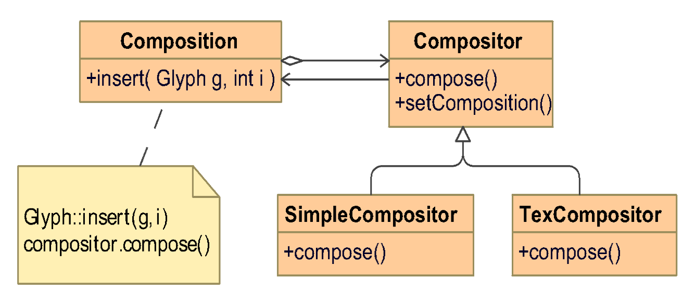

# Inventory

- [Inventory](#inventory)
- [Lecture Outline](#lecture-outline)
- [The concept of design pattern](#the-concept-of-design-pattern)
- [Specific problem](#specific-problem)
- [Composite pattern](#composite-pattern)
- [Strategy pattern](#strategy-pattern)
- [Decorator pattern](#decorator-pattern)
- [Example: IO stream class](#example-io-stream-class)

# Lecture Outline

- description
- roles
- a case: design a document editor
    - compisite pattern (doc data)
    - strategy pattern (doc formatting)
    - decorator pattern (interface elements)

# The concept of design pattern

a problem + core solution

description of a pattern:

- name
- problem
- solution
- consequence
  - space and time trade-offs
  - impact on system's flexibility, extensibility, portability

roles of design pattern:

- application programs
  - reduce class dependencies
  - reduce platform dependencies
- toolkit
  - reduce code reuse
  - C++ STL
- framework

when not to use dp:

- Drawbacks of using design patterns
  - Complicate the design
  - Degrade the performance of the system, in terms of space and time requirements.
- Only use design patterns if you want:
  - Flexibility
  - Extensibility
  - portability

# Specific problem

A WYSIWYG document editor

design problesm:

- Document structure
- Formatting
- Embellishing the user interface
- Multiple look-and-feel standards
- User Operations
- Spelling checking and hyphenation

statement design:

composition and compositor:

user interface, decorator:

# Composite pattern

- applicability
  - part-whole
  - single and composite object
- structure
- participant
  - component
    - common interface
    - default behavior
    - access and manage its child components
    - access a component's parent

# Strategy pattern

more.

# Decorator pattern

more.

- for user interface
- The basic class is enclosed by a decorator class
- The decorator class conforms to the interface of the basic class.
- Implementation of the interface:
  - Forwards requests to the basic class
  - Perform any additional actions before or after the forwarding
- Consequence: decorators can be nested recursively.

# Example: IO stream class

[on index README page.](../README.mds)