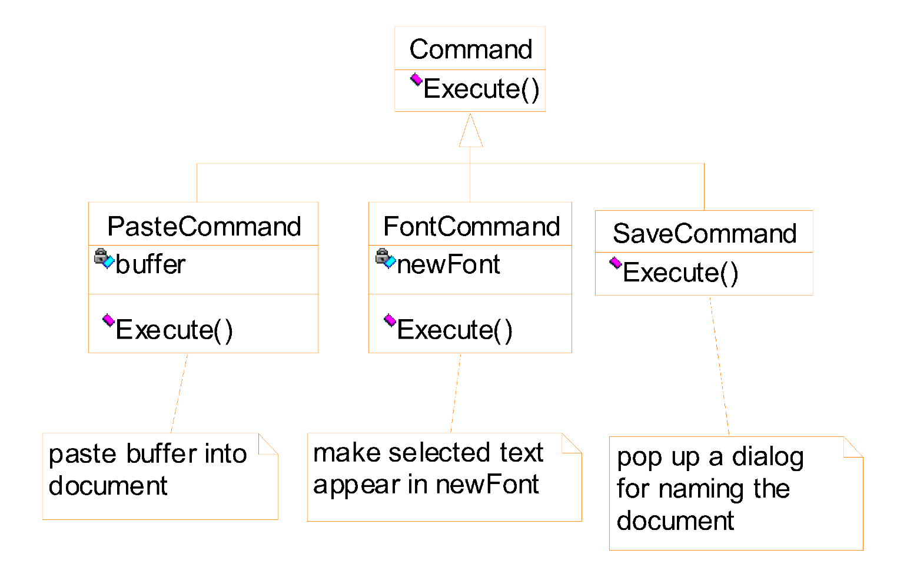
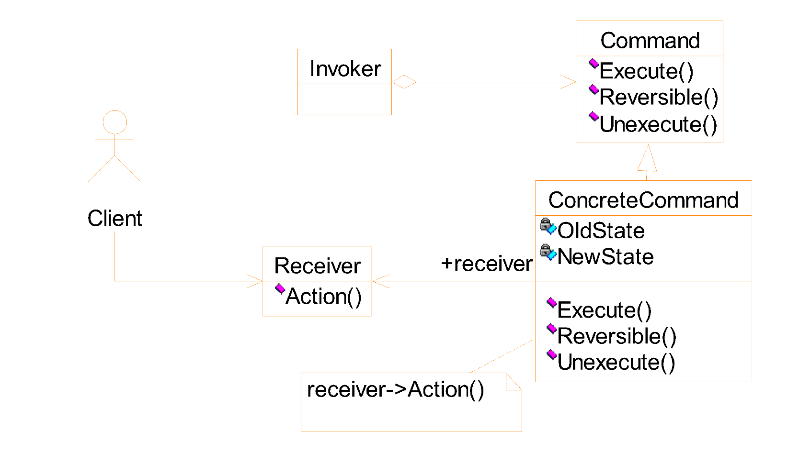

# Requirements

- Multiple widgets can be mapped onto the same operation
- We do not want the close coupling between the classes that implement the operations and the interface classes.
- We want to support the Undo/Redo functionality

# MFC solution

- [x] first two
- [ ] undo/redo <- command pattern

# Undo

- undo info must also be stored
- undoability
- command history stored

## Applicability

- Support undo
- Support context-sensitive menus
- Support command macros
- Support logging changes to recover a crashed system
- Support the concept of transaction in an information system

