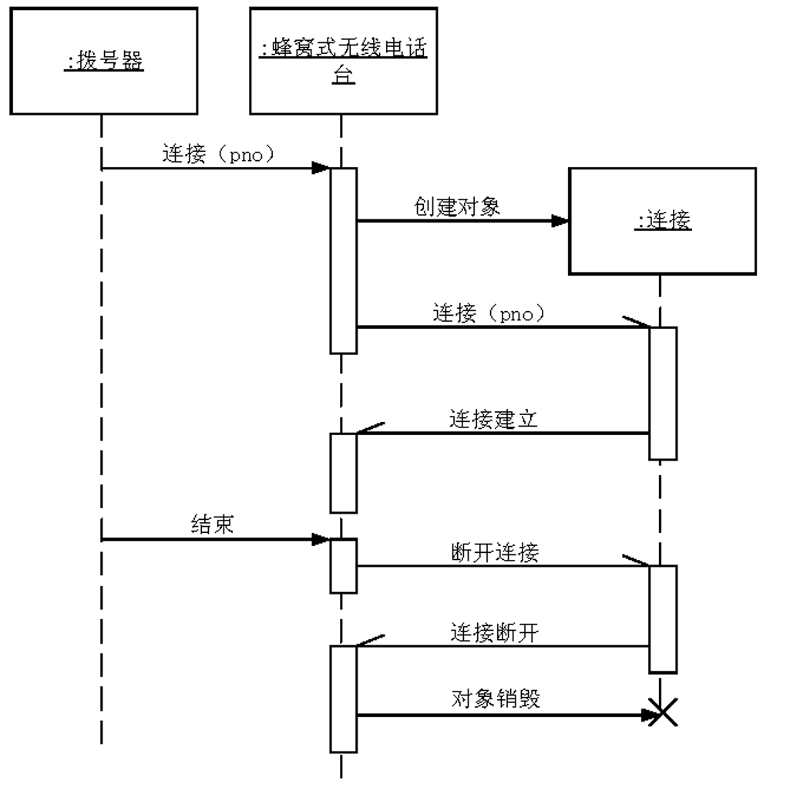
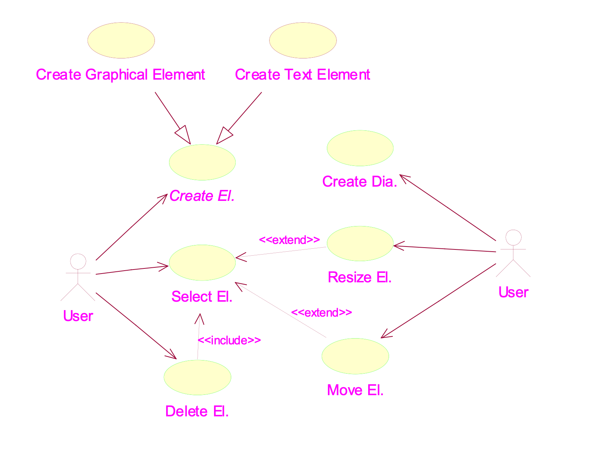
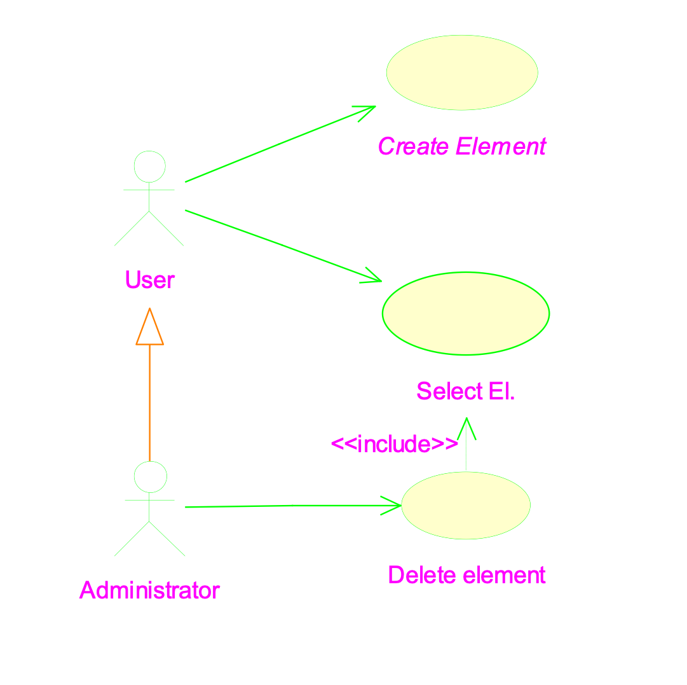

# Inventory

- [Inventory](#inventory)
- [Use-case diagram](#use-case-diagram)
  - [Actors](#actors)
  - [Use case](#use-case)
- [Sequence diagram](#sequence-diagram)
  - [Elements in a sequence diagram](#elements-in-a-sequence-diagram)
- [A collaboration diagram](#a-collaboration-diagram)
- [Extension of use case](#extension-of-use-case)
- [Examples](#examples)

# Use-case diagram

- role played
  - init statement of the requirements
  - external visible behavior
- components
  - actors
  - use case

## Actors

- different groups of users
- no one-to-one correspondence
- not necessary to be human
  - human
  - computer system
  - some devices

## Use case

details:

- abstract
- definition: description of a whole class of interactions that have the same overall intention
- consists of 
  - a basic course of events
  - alternative courses
  - exceptional courses

inclusion of use case:

- stereotype: specification of a relationship

realization of a use case:

- describe interaction
- notation: interaction diagram
  - sequence (more informative)
  - collaboration (more concise)

# Sequence diagram

## Elements in a sequence diagram

- objects: at the top
- time flows downward
- lifeline
- messages & message to oneself
  - represent implementation details
  - should be made explicit
  - causes recursive activity
- activation: process a message
- construction of a new object

# A collaboration diagram

order of messages should be explicitly specified

examples:

1. select an element: return messages
2. delete an element: termination of objects
3. move an element: use case extension

# Extension of use case

```
┌─────────────┐                   ┌──────────────┐
│             │   <<extend>>      │              │
│             ├───────────────────┤              │
│             │                   │              │
│             │                   │              │
└─────────────┘                   └──────────────┘
Move Element                      Select Element

┌─────────────┐                   ┌──────────────┐
│             │   <<extend>>      │              │
│             ├───────────────────┤              │
│             │   (drag corner)   │              │
│             │ [click on control │              │
└─────────────┘  point]           └──────────────┘
Resize Element                    Select Element
```

# Examples

asynchronous message and multiple threads:


the complete use case diagram:


generalization between actors:

