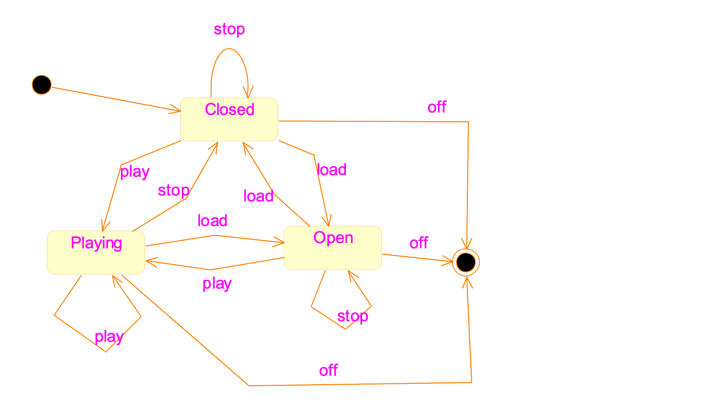
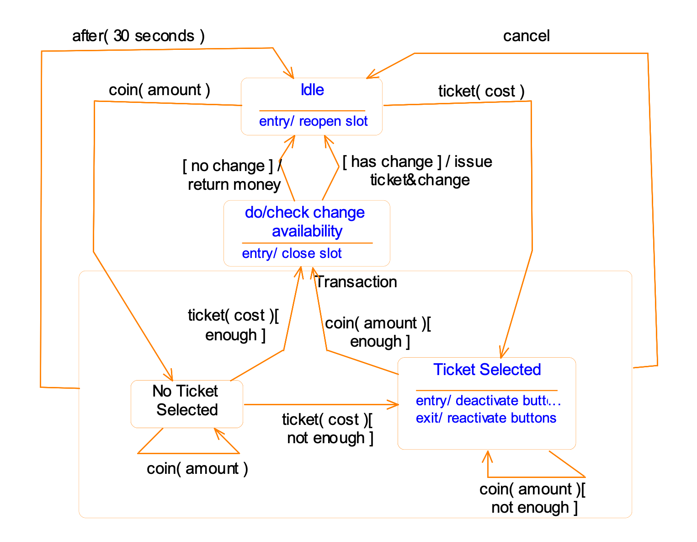

# Inventory

- [Inventory](#inventory)
- [Outline](#outline)
- [Components of statechart](#components-of-statechart)
- [CD player example](#cd-player-example)
- [Entry and exit actions](#entry-and-exit-actions)
- [Activities](#activities)
- [Internal transition](#internal-transition)
- [Composite states](#composite-states)
  - [Properties](#properties)
- [History state](#history-state)
- [Automatic ticket machine example](#automatic-ticket-machine-example)

# Outline

important

- why statechart
- state, transition, initlial and final states
- actions, guard conditions
- entry and exit action
- activities

normal

- composite states
- history states
- a real example
- quiz on automatic ticket machine
- implementation of statechart

# Components of statechart

- state
- event
- transition
- initial and final states
- actions

# CD player example

# Entry and exit actions

- entry: performed every time a state becomes active
- exit: leave the state

# Activities

- Activities
  - The operation continues to run throughout the period when the state is active.
  - Can be interrupted by other events.
  - If no event interrupt it, completion transitions will be issued
- Actions
  - Can be though of as being instantaneous
  - Can not be interrupted by other events. 

# Internal transition

Some events cause transitions to the current state, but without triggering the execution of the entry and exit actions.

# Composite states

- to simplify statechart
- applicability: common transitions (outgoing or incoming)
- state & substate

## Properties

- If a composite state is active, exactly one of its substate must also be active
- Outgoing transition: can flow from the composite state, or from a substate
- Incoming transition: can flow to the composite state, or to a substate
- Initial state: becomes active when an incoming transition reaches at the boundary
- Final state: when ongoing activity has finished; issue completion transitions
- Entry/exit actions

# History state

- requirement: if a button is pressed, return to A or B state
- composite state can remember a history state
  - denoted by an "H" state

# Automatic ticket machine example

1. preliminary statechart
2. enter money before selecting a ticket type
3. integrating the transactions
4. time events
   1. after
   2. when
5. action states
   1. avoid repetitions
   2. performe some internal processing
   3. only contains an activity
   4. not respond to external events
   5. no overuse them

