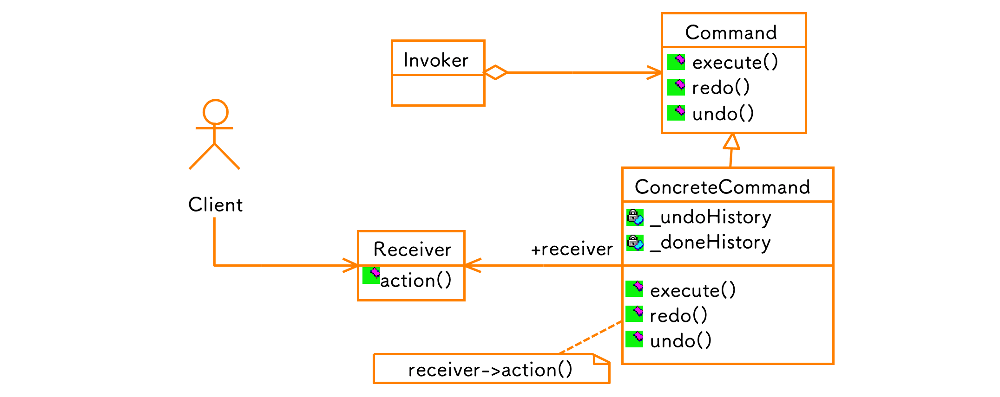
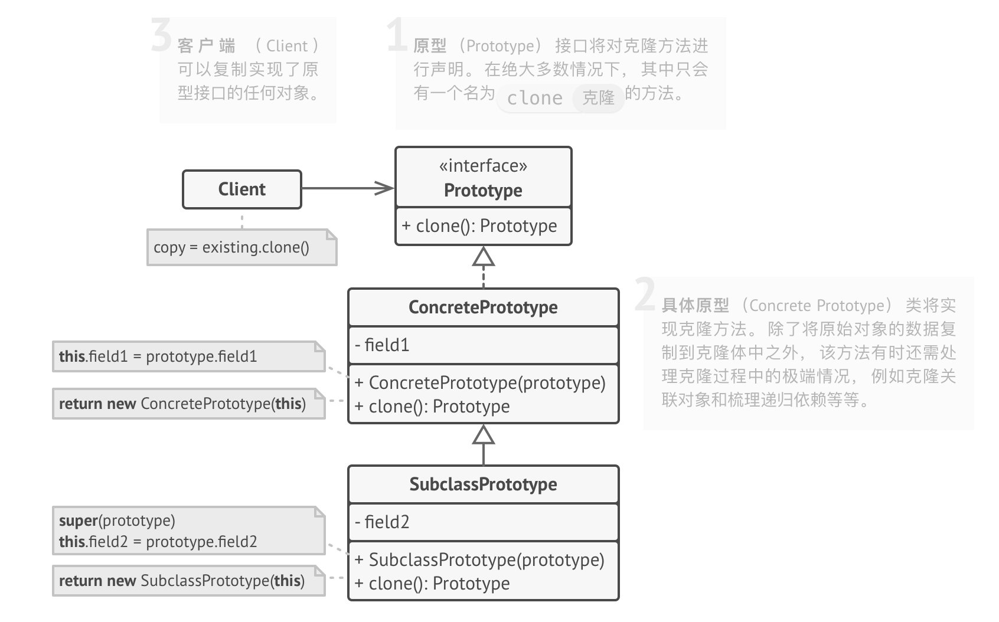

# Reference

- [设计模式目录](https://refactoringguru.cn/design-patterns/catalog)
- [菜鸟教程 - 设计模式 - Java实现](https://www.runoob.com/design-pattern/design-pattern-tutorial.html)

# 命令模式

- **命令模式**是一种行为设计模式， 它可将请求转换为一个包含与请求相关的所有信息的独立对象。 该转换让你能根据不同的请求将方法参数化、 延迟请求执行或将其放入队列中， 且能实现可撤销操作。
- 为每个可能的操作实现一系列命令类， 并且根据按钮所需行为将命令和按钮连接起来。
- **命令**是一种行为设计模式， 它可将请求或简单操作转换为一个对象。此类转换让你能够延迟进行或远程执行请求， 还可将其放入队列中。

# 迭代器模式

- **迭代器模式**是一种行为设计模式， 让你能在不暴露集合底层表现形式 （列表、 栈和树等） 的情况下遍历集合中所有的元素。
- 迭代器模式的主要思想是将集合的遍历行为抽取为单独的*迭代器*对象。
- 在迭代器的帮助下， 客户端可以用一个迭代器接口以相似的方式遍历不同集合中的元素。

# 访问者模式

- **访问者模式**是一种行为设计模式， 它能将算法与其所作用的对象隔离开来；允许你在不修改已有代码的情况下向已有类层次结构中增加新的行为。
- 访问者模式建议将新行为放入一个名为*访问者*的独立类中， 而不是试图将其整合到已有类中。 现在， 需要执行操作的原始对象将作为参数被传递给访问者中的方法， 让方法能访问对象所包含的一切必要数据。

## 构建者模式

生成器模式建议将对象构造代码从产品类中抽取出来， 并将其放在一个名为*生成器*的独立对象中。

# 工厂模式

工厂方法模式建议使用特殊的*工厂*方法代替对于对象构造函数的直接调用 （即使用 `new`运算符）。 不用担心， 对象仍将通过 `new`运算符创建， 只是该运算符改在工厂方法中调用罢了。 工厂方法返回的对象通常被称作 “产品”。

# 原型模式

- 创建一系列不同类型的对象并不同的方式对其进行配置。 如果所需对象与预先配置的对象相同， 那么你只需克隆原型即可， 无需新建一个对象。
- 原型是一种创建型设计模式， 使你能够复制对象， 甚至是复杂对象， 而又无需使代码依赖它们所属的类。
- 所有的原型类都必须有一个通用的接口， 使得即使在对象所属的具体类未知的情况下也能复制对象。 原型对象可以生成自身的完整副本， 因为相同类的对象可以相互访问对方的私有成员变量。

GraphicTool找不到具体Graphic类：

1. 工程模式：每种乐谱对象都创建对应的工厂类, 每次调用特定的工厂创建乐谱类

2. 原型模式：每次仅需要切换原型, 就可以通过 clone 创建新类, 比工厂消耗更少的资源

# 适配器模式

- **适配器模式**是一种结构型设计模式， 它能使接口不兼容的对象能够相互合作。
- 你可以创建一个*适配器*。 这是一个特殊的对象， 能够转换对象接口， 使其能与其他对象进行交互。
- 适配器可担任两个对象间的封装器， 它会接收对于一个对象的调用， 并将其转换为另一个对象可识别的格式和接口。

Example: 在 TextShape 中使用了 TextView 的方法, TextShape 这里做适配器, 整合 Shape 和 TextView 俩个方法

Example: lambda实现适配器

- lambda
  - [ ]
  - [&]
  - [=]
  - [x, &y]
  - [&, x]
  - [=, &z]
  - [this]
- std::function
- closure

`Requset` 是一个函子, 通过切换不同的函子, 以实现多功能适配器:

# 桥接模式

- **桥接模式**是一种结构型设计模式， 可将一个大类或一系列紧密相关的类拆分为抽象和实现两个独立的层次结构， 从而能在开发时分别使用。
- 层次结构中的第一层 （通常称为抽象部分） 将包含对第二层 （实现部分） 对象的引用。 抽象部分将能将一些 （有时是绝大部分） 对自己的调用委派给实现部分的对象。 所有的实现部分都有一个通用接口， 因此它们能在抽象部分内部相互替换。

Example: 我有一个 `Window` , 现在我需要实现 `dialog` 功能。将抽象部分和实现部分分离, 将 `X` 功能的实现进行抽离, `DialogWindow` 有一个操作指针, 要 `X` 功能就把 `imp` 指向 `X` 操作类, 要 `PM` 功能就把 `imp` 指向 `PM` 操作类, 不需要额外重写 `PMDialogWindow`

# 责任链模式

- **责任链模式**是一种行为设计模式， 允许你将请求沿着处理者链进行发送。 收到请求后， 每个处理者均可对请求进行处理， 或将其传递给链上的下个处理者。
- 该模式允许多个对象来对请求进行处理， 而无需让发送者类与具体接收者类相耦合。 链可在运行时由遵循标准处理者接口的任意处理者动态生成。

# 解释器模式

- 提供了评估语言的语法或表达式的方式，它属于行为型模式。
- 这种模式实现了一个表达式接口，该接口解释一个特定的上下文。这种模式被用在 SQL 解析、符号处理引擎等。
- 关键代码：构建环境类，包含解释器之外的一些全局信息，一般是 HashMap

Example: bool expression

