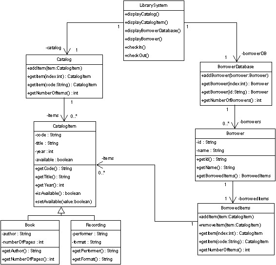
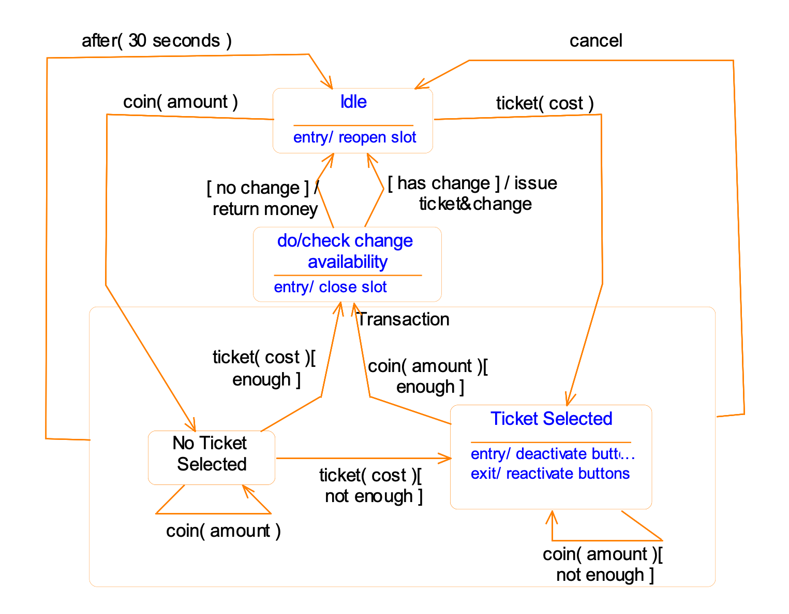
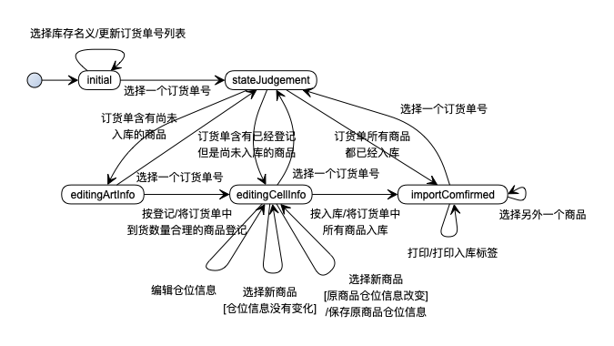
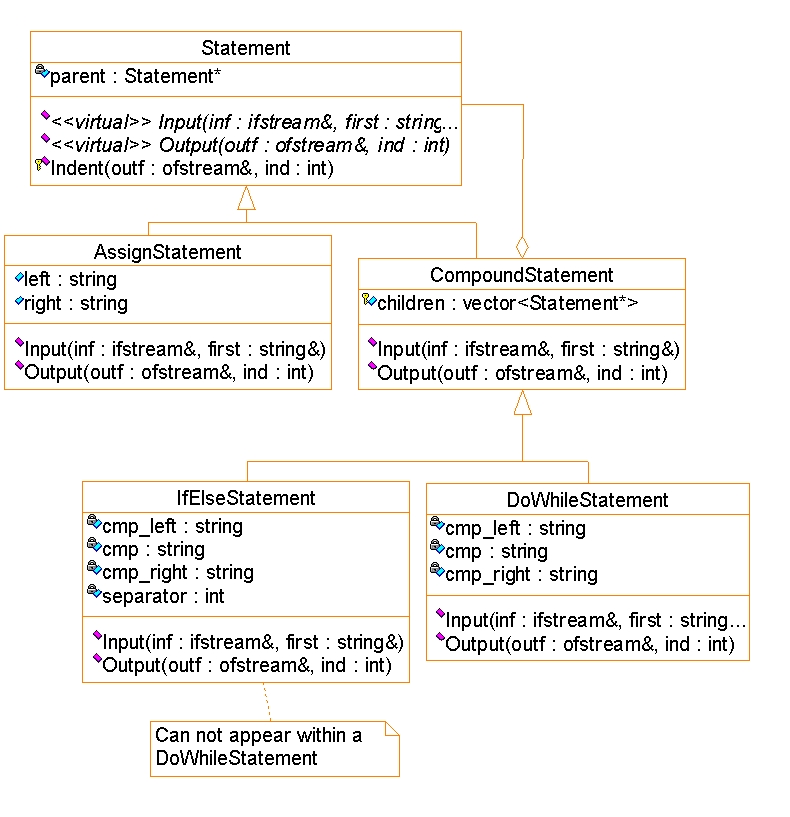
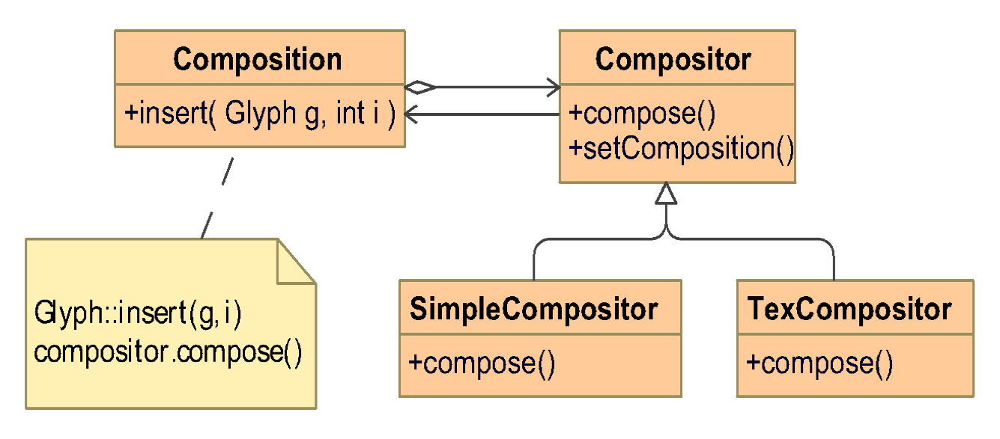
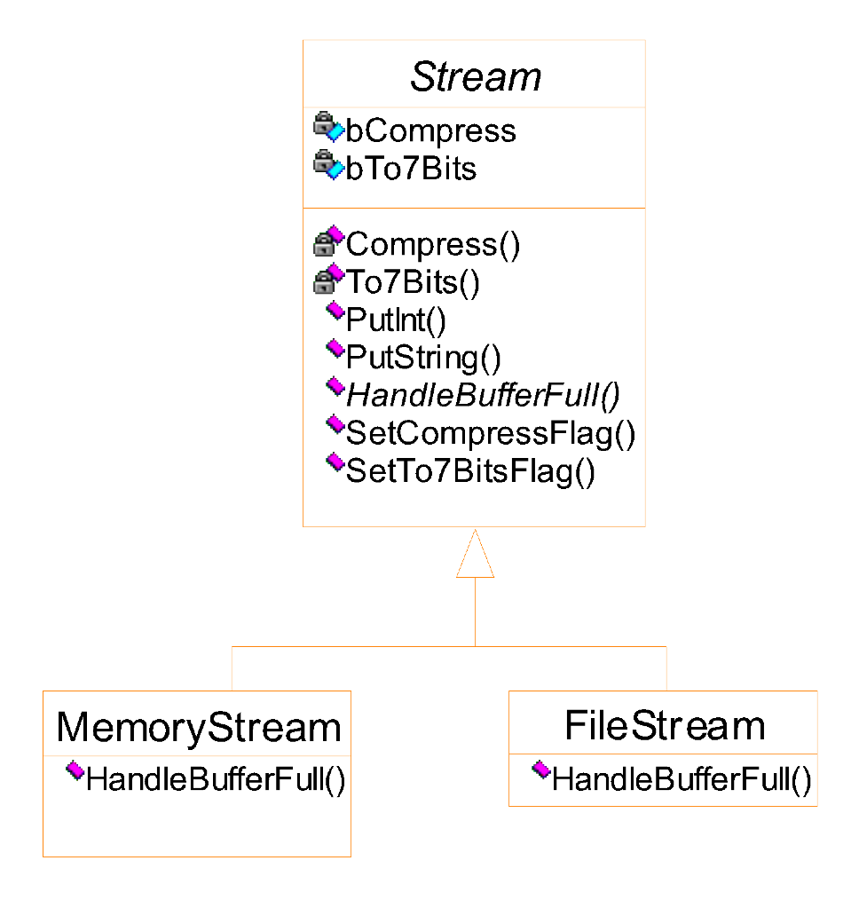
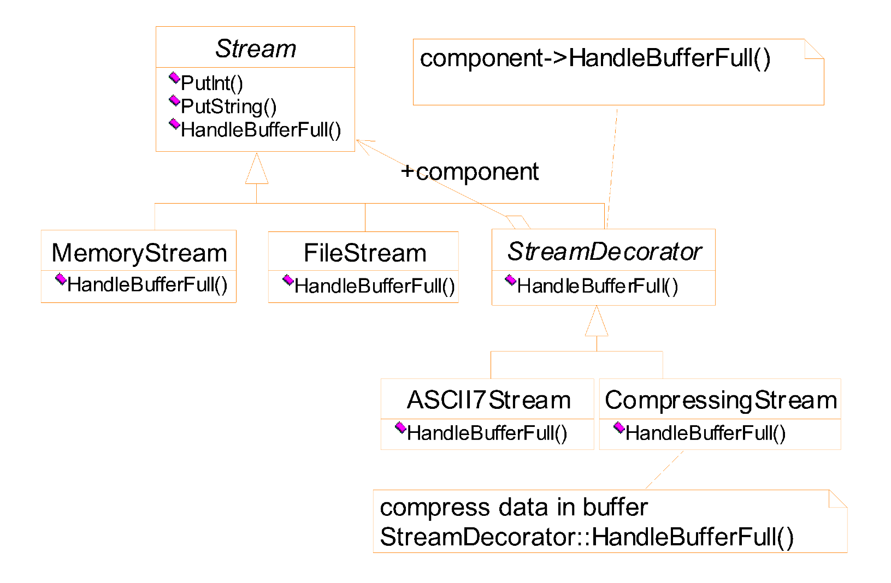
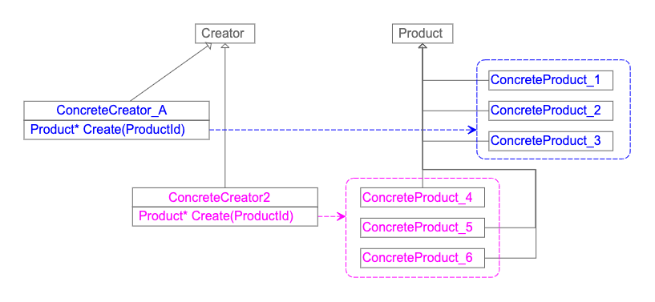
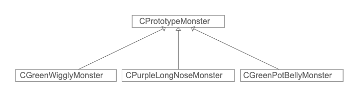

# Class

面向对象软件方法学, College of Software, NKU

# Online tool

- [yEf live](https://www.yworks.com/yed-live/)

# Emphasis

- [UML](./UML.md)
  - [ ] **类图**
  - [ ] 用例图
  - [ ] 顺序图
  - [ ] 状态图
- [Design pattern](./Pattern.md)
  - [ ] 组合模式 -> document data
  - [ ] 策略模式 -> document formatting
  - [ ] 装饰器模式 -> user interface
  - [ ] 命令模式 -> document editing (undo/redo command)
  - [ ] 抽象工厂模式 -> abstract widget class & subclass
  - [ ] 迭代器模式 -> iterator in list, robust iterator, pre-order traverse
  - [ ] 访问者模式
  - [ ] 代理模式 -> relieve iterator
  - [ ] 建造者模式 -> RTF document reader
  - [ ] **工厂模式** -> multiple document framework
  - [ ] 原型模式 -> editor for music scores
  - [ ] 适配器模式 -> drawing editor
  - [ ] 桥接模式 -> portable window
  - [ ] 外观模式 -> compiler system
  - [ ] 责任链模式 -> help handler
  - [ ] 解释器模式 -> boolean expression

# Lecture Outline

1. Intro
   - Why modeling
   - Modeling methods
   - Why UML
   - Fundamental elements of UML
     - Views
     - Diagrams
2. Modeling with objects
   - properties, navigibility, message passing
   - strength of OOP
   - the object model
     - data + operations
     - execution of a program
       - a dynamic network of intercommunicating objects
         - nodes(object)
         - links(send messages)
     - semantic foundation for UML's design models
   - example: the stock control
3. Class diagram
   - attributes
   - operations
   - relationship
   - assoications, association generalization
   - aggregation
   - composite objects
   - association classes
   - qualified associations
   - multiple inheritance in UML
   - mixin class
   - discriminators
   - implementation of class dirgam
     - uni-directional association
     - bi-directional association
     - implement qualifiers
     - implementation of association classes
4. Use-case diagram
   - actors
   - a use-case should be abstract
   - generalization, specialization
   - inclusion, extension
5. Sequence diagram
   1. first step of designing
   2. an example
   3. components of a sequence diagram
   4. collaboration diagram
   5. condiional/asynchronous message, etc
6. State diagram
   - why statechart
   - state, transition, initlial and final states
   - actions, guard conditions
   - entry and exit action
   - activities
   - composite states
   - history states
   - a real example
   - quiz on automatic ticket machine
   - implementation of statechart
7. Basics of design pattern
   - description
   - roles
   - a case: design a document editor
     - compisite pattern (doc data)
     - strategy pattern (doc formatting)
     - decorator pattern (interface elements)
   - command pattern (undo+redo)
8. abstract factory pattern
  - pattern
  - implementation (singleton, make)
9. iterator & visitor pattern
  - iterator
  - proxy pattern
  - pre-order traversing
10. Builder pattern
11. Factory method pattern
12. Prototype pattern
13. Adaptor pattern
14. Bridge pattern
15. Facade pattern
16. Chain of responsiblity
17. Interpreter pattern

# Examples of diagram

Library class diagram:



State diagram of automatic ticket machine:



State diagram of order system:




# Examples of design pattern

## Document editor design

1. Statement design



2. composition and compositor



## IO stream class

1. Solution1: use flags -> fat root class



2. Solution2: use decorator pattern

```c++
Stream * fStream = new FileStream("test.cpp");
Stream * mStream = new MemoryStream();
Stream * fcStream = new CompressingStream( new FileStream("test.cpp") );
Stream * f7Stream = new ASCII7Stream ( new FileStream("test.cpp") );
Stream * fc7Stream = new CompressingStream( 
new ASCII7Stream ( new FileStream("test.cpp") ));

fc7Stream->PutInt(12);
fc7Stream->PutString("hello");
```



## Undo/Redo

[GO](./Lectures-of-design-pattern/lecture7.md)


## Create with product ID

factory method pattern



## A game based on prototype pattern


