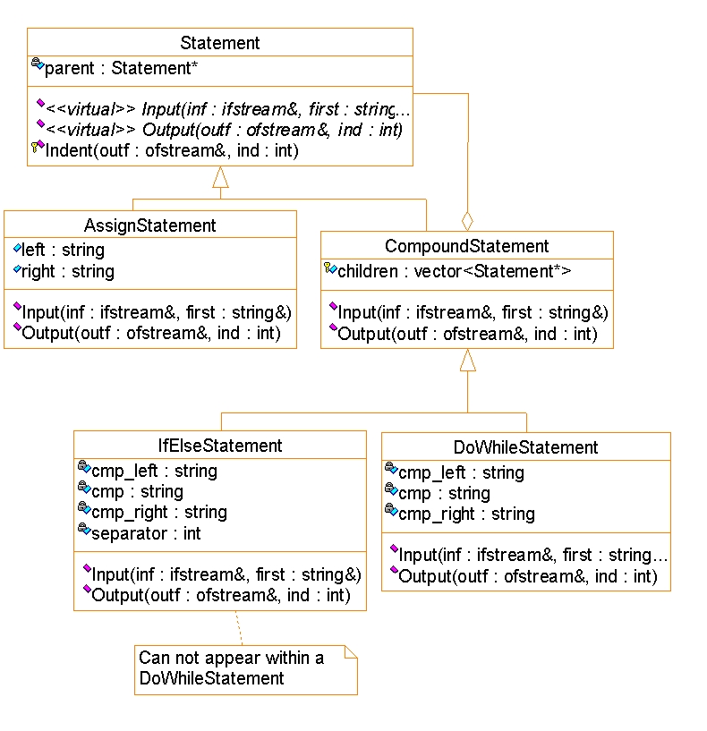

# Class

面向对象软件方法学, College of Software, NKU

# Online tool

- [yEf live](https://www.yworks.com/yed-live/)

# Emphasis

- UML
  - [ ] 类图
  - [ ] 用例图
  - [ ] 顺序图
  - [ ] 状态图
- Design pattern
  - [ ] 组合模式
  - [ ] 策略模式
  - [ ] 装饰器模式

# Lecture Outline

1. Intro
   - Why modeling
   - Modeling methods
   - Why UML
   - Fundamental elements of UML
     - Views
     - Diagrams
2. Modeling with objects
   - properties, navigibility, message passing
   - strength of OOP
   - the object model
     - data + operations
     - execution of a program
       - a dynamic network of intercommunicating objects
         - nodes(object)
         - links(send messages)
     - semantic foundation for UML's design models
   - example: the stock control
3. Class diagram
   - attributes
   - operations
   - relationship
   - assoications, association generalization
   - aggregation
   - composite objects
   - association classes
   - qualified associations
   - multiple inheritance in UML
   - mixin class
   - discriminators
   - implementation of class dirgam
     - uni-directional association
     - bi-directional association
     - implement qualifiers
     - implementation of association classes
4. Use-case diagram
   - actors
   - a use-case should be abstract
   - generalization, specialization
   - inclusion, extension
5. Sequence diagram
   1. first step of designing
   2. an example
   3. components of a sequence diagram
   4. collaboration diagram
   5. condiional/asynchronous message, etc
6. State diagram
   - why statechart
   - state, transition, initlial and final states
   - actions, guard conditions
   - entry and exit action
   - activities
   - composite states
   - history states
   - a real example
   - quiz on automatic ticket machine
   - implementation of statechart
7. Basics of design pattern
   - description
   - roles
   - a case: design a document editor
     - compisite pattern (doc data)
     - strategy pattern (doc formatting)
     - decorator pattern (interface elements)

# Examples of diagram

Library class diagram:

State diagram of automatic ticket machine:

State diagram of order system:

# Examples of design pattern

Statement design:

